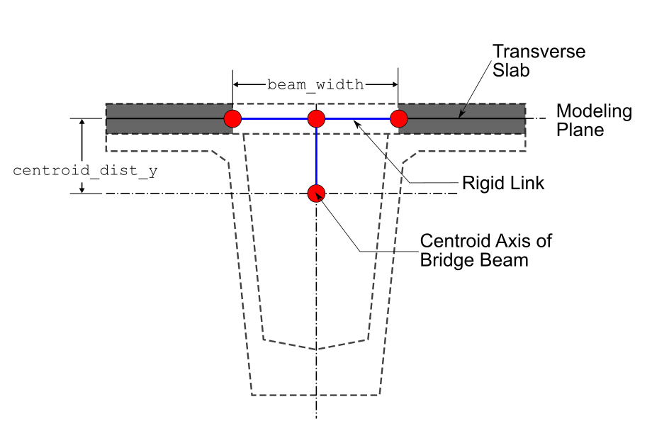
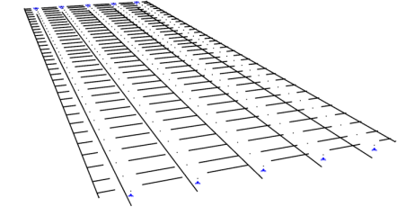
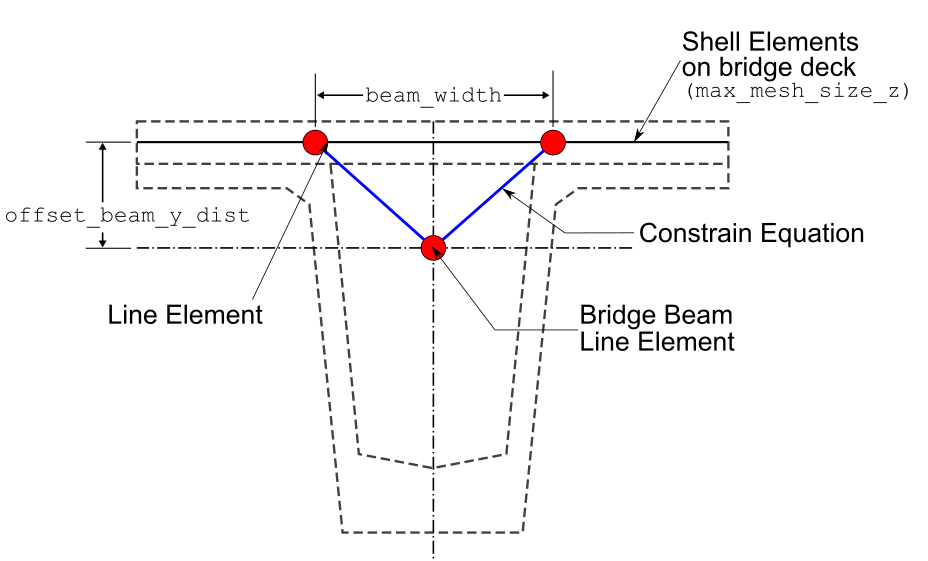

# Model types available

## Which model type should I use?

The table below summarises the three available model types and the situations each is best suited to. All three are created through {func}`~ospgrillage.osp_grillage.create_grillage`; only the `model_type` keyword (and a few type-specific keyword arguments) differ.

| Model type | `model_type` kwarg | Best suited for | Additional inputs required |
|---|---|---|---|
| **Beam only** | *(default)* `"beam_only"` | Routine bridge deck grillage analysis; fastest to set up and run; well understood by practitioners. | None beyond the standard arguments. |
| **Beam with rigid links** | `"beam_link"` | Composite sections where the neutral axes of longitudinal and transverse members are offset from the grillage plane (e.g. Super-T girders). | `beam_width`, `web_thick`, `centroid_dist_y` |
| **Shell & Beam** | `"shell_beam"` | Studies where two-dimensional slab behaviour is important (punching, local bending); highest fidelity but most computationally expensive. | `max_mesh_size_z`, `offset_beam_y_dist`, `link_nodes_width`; shell member must be assigned via `set_shell_members()`. |

**Rule of thumb:** start with *Beam only* to verify boundary conditions and loading, then switch to *Beam with rigid links* or *Shell & Beam* once the global model is validated.

For the example code on this page, *ospgrillage* is imported as `og`

```python
import ospgrillage as og
```

## Beam Elements Only — `beam_only`

This is the traditional modelling approach that is comprised of beam elements lay out in a grid pattern, with:

-   longitudinal members representing composite sections along longitudinal direction (e.g. main beams);
-   transverse members representing slabs or secondary beam sections.

This is the default model type if `model_type` keyword argument is not specified to {func}`~ospgrillage.osp_grillage.create_grillage`

```python
example_bridge = og.create_grillage(bridge_name="Super T grillage", long_dim=10, width=7, skew=-42,
                                num_long_grid=7, num_trans_grid=5, edge_beam_dist=1, mesh_type="Ortho")
```

More information of this model type can be found [here](https://www.steelconstruction.info/Modelling_and_analysis_of_beam_bridges).

## Beam with Rigid Links — `beam_link`

This is a modified version of the traditional beam element model with the following features:

-   Offsets (in x-z plane) for start and end nodes along direction of transverse members - using joint offset.
-   Offsets (in vertical y direction) for start and end nodes of longitudinal members - again using joint offsets.

Figure 2 shows the details of the aforementioned model type. Figure 3 shows the model type created in a similar commercial software SPACEGASS.





To create this model, set `model_type="beam_link"` in {func}`~ospgrillage.osp_grillage.create_grillage`.

```python
example_bridge = og.create_grillage(bridge_name="Modified bridge grillage", long_dim=10, width=7, skew=-12,
                                    num_long_grid=7, num_trans_grid=5, edge_beam_dist=1, mesh_type="Ortho",
                                    model_type="beam_link",
                                    beam_width=1, web_thick=0.02, centroid_dist_y=0.499)
```

The joint offsets are rigid links. Information can be found in `OpenSeesPy`'s [geomtransf](https://openseespydoc.readthedocs.io/en/latest/src/LinearTransf.html)

Table 1 outlines the specific variables for the beam link model.

| Keyword argument | Description |
|---|---|
| `beam_width` | Width of the beam/longitudinal members — used to define the offset distance in the z direction. |
| `web_thick` | Thickness of web — used to define the offset distance in the z direction. |
| `centroid_dist_y` | Distance in the y direction to offset longitudinal members (exterior and interior main beams). |

*Table 1: Input arguments for the beam link model.*

```{note}
As of release 0.1.0, `OpenSeesPy` visualization module `vfo` and `opsvis` is unable to visualize the joint offsets.
```

(shell-hybrid-model)=
## Shell & Beam Elements — `shell_beam`

This is a more refined model using two element types — shell and beam elements — with the following features:

-   Shell elements lay in grids to represent bridge decks.
-   Beam elements modelled with an offset to the plane of shell elements to represent longitudinal beam sections.
-   Beam elements linked to shell elements at two corresponding locations using constraint equations — `OpenSeesPy`'s **rigidLink** command.

This model has advantages in modelling slabs using shell elements which are well-suited to represent two-dimensional slab behaviour. Figure 4 shows the details and variables of the shell beam hybrid model.



When `model_type="shell_beam"` is selected, *ospgrillage* automatically determines the position of shell elements within the grillage plane. Users only have to define and assign the section of the shell element via {func}`~ospgrillage.members.create_section` and {func}`~ospgrillage.osp_grillage.OspGrillageShell.set_shell_member` respectively. The following example code shows the steps to create the shell model type:

```python
# create section of shell element
slab_shell_section = og.create_section(h=0.2) # h = thickness
# shell elements for slab
slab_shell = og.create_member(section=slab_shell_section, material=concrete)
# create grillage with shell model type
example_bridge = og.create_grillage(bridge_name="Shell grillage", long_dim=10, width=7, skew=0,
                                    num_long_grid=6, num_trans_grid=11, edge_beam_dist=1, mesh_type="Orth",
                                    model_type="shell_beam", max_mesh_size_z=0.5, offset_beam_y_dist=0.499,
                                    link_nodes_width=0.89)
# set shell members to shell elements
example_bridge.set_shell_members(slab_shell)
```

Table 2 outlines the specific variables for the shell hybrid model.

| Keyword argument | Description |
|---|---|
| `max_mesh_size_z` | Max mesh size in the z direction. *ospgrillage* automatically determines the mesh size based on this value and the spacing of link nodes. |
| `offset_beam_y_dist` | Distance between offset beams and the grillage shell plane. |
| `beam_width` | Width between link nodes (left and right links to offset beam elements) in the global z direction. |

*Table 2: Input arguments for the shell hybrid model.*
