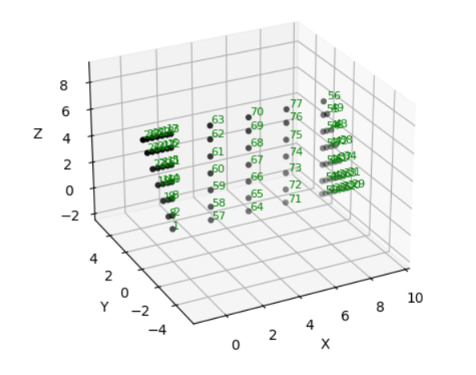

========================
Using the grillage wizard
========================

The *ops-grillage* module contains the main :class:`~OpsGrillage` class that handles:

#. model information inputs.
#. creating the model instance in Opensees software space, and
#. writes an executable py file with commands that can recreate the model.

Creating the grillage model
---------------------------
The process of creating a grillage model can be categorized into three steps:

#. Creating the grillage object using the :class:`~OpsGrillage` class.
#. Defining various elements of grillage model using the :class:`~Member` class, and :class:`~Material` class.
#. Setting the elements of grillage model using :function:`~set_member()` and :function:`~set_material()` functions.


An example usage of the :class:`~OpsGrillage` is shown as follows:

.. code-block:: python

    example_bridge = OpsGrillage(bridge_name="SuperT_10m", long_dim=10, width=5, skew=-21,
                         num_long_grid=2, num_trans_grid=17, cantilever_edge=1, mesh_type="Ortho")

The above example generates an Opensees model instance of a grillage model with the following properties

#. Length = 10 m
#. Width = 5 m
#. skew angle of 21 degree clockwise (negative sign)
#. 2 node grids along the transverse (z axis) direction corresponding to interior beams
#. 13 nodes spaced evenly along the longitudinal (x axis)
#. Edge beam distance of 1 m
#. Orthogonal mesh



    Figure 1: Created nodes.

The code simultaneously generates an executable py file named "SuperT_10m", which upon executing, creates the prescribed
model in Opensees space.

Up to this point, the model in Opensees space and its corresponding executable py file only have the following
commands defined:

#. command to instantiate the model space in Opensees.
#. node() commands
#. Created the geometric transformation object of Opensees for the element definition later on.

The :class:`~OpsGrillage` class contains information which require user input. These information include:

#. Connectivity of nodes forming the elements of grillage model
#.

Information

Define material properties
------------------------

Material properties are defined in two steps:

#. Creating a :class:`~Material` class object of the bridge material.
#. Setting the :class:`~Material` class object to a :class:`~GrillageMember` class object.

For most bridges made of steel and concrete, material properties of either concrete and steel can be defined using
keyword "steel" or "concrete" passed as an argument to :class:`~Material` class.

.. code-block:: python

    # define material
    concrete = UniAxialElasticMaterial(mat_type="Concrete01", mat_vec=[-6.0, -0.004, -6.0, -0.014])

The :class:`~OpsGrillage` class also allows for global material definition - e.g. an entire bridge made of the same
material. To do this, users run the function ```set_material()``` passing the :class:`~Material` class object as the
input.

.. code-block:: python
    # assign material object to grillage model class
    test_bridge.set_material(concrete)

Note for variable `mat_type`, users have the option to change the concrete type. The concrete model types are based on
Opensees database.

Creating section of grillage members
------------------------------------------------

.. code-block:: python

    # define sections
    I_beam_section = Section(op_sec_tag='Elastic', A=0.896, E=3.47E+10, G=2.00E+10, J=0.133, Iy=0.213, Iz=0.259,
                         Ay=0.233, Az=0.58)


For skew meshes without customized node points, the grillage elements typically comprised of standardized element groups.
Table 1 shows the standard elements of a grillage model along with the respective str arguments. Users

 ===================================   ===========================================================================
   1                                    edge_beam
   2                                    exterior_main_beam_1
   3                                    interior_main_beam
   4                                    exterior_main_beam_1
   5                                    edge_slab
   6                                    transverse_slab
 ===================================   ===========================================================================

For orthogonal meshes, nodes in the transverse direction have varied spacing based on the skew edge region.
The properties of transverse members based on unit metre width is required for its definition section properties.
The module automatically implement the unit width properties based on the spacing of nodes in the skew edge regions.

The module checks if all element groups in the grillages are defined by the user. If missing element groups are detected,
a warning message is printed on the terminal.

Creating a grillage member
-----------------------------
Grillage members are defined using the ``GrillageMember`` class. The class accepts three inputs: str name of the member,
a Section class object, and a Material class object.

.. code-block:: python
    # define member
    I_beam = GrillageMember(name="Intermediate I-beams", section=I_beam_section, material=concrete)


Setting grillage member to element group in model
-------------------------------------------------
The members of the grillage model is set using the `set_member()` function of ``opGrillage`` class. The function takes a `member` class
object, and a member string tag as arguments. The function the assigns the `member`
object to the element group in the grillage model.

An example showing the assignment of interior main beams:

.. code-block:: python
    test_bridge.set_grillage_members(longmem_prop, longmem_prop.op_ele_type, member="interior_main_beam")

The following is printed to the terminal


Run grillage for analysis
------------------------

The first step on using the grillage model for analysis is defining Openseespy analysis objects, namely using the
pattern() and constraint() classess. Based on the desired analysis, users can add these lines of code manually to
the output file.

Alternatively, users can run the class function `perform_gravity_analysis()` to conduct a simple gravity load analysis.
The class function is also a good way to test run the model.

Viewing results
------------------------

A set of plotting functions are included as part of the `op-grillage` module - the `PlotWizard` command. To draw and
plot components of the model, users run the following example. In the example, the plot_section() function draws and
plots the longitudinal members of the grillage.

.. code-block:: python

    import PlotWizard
    plot_section(test_bridge, "interior_main_beam", 'r')

The `plot_section()` function is based on matplotlib plotting commands.

Alternatively, result visualization can be achieved using the Openseespy module - ops_vis. The `ops_vis` module is one
of the post-processing modules of Openseespy. The `ops-vis` module has gone through numerous updates and has reach
maturity for many post-processing applications. This is the recommended plotting feature at the current version of
`op-grillage`.

For example users can view the model using the `model()` command. To do this, users add the following command and the
end of the output py file.

.. code-block:: python

    ops.model()

The main commands of ops_vis module can be found `here <https://openseespydoc.readthedocs.io/en/latest/src/ops_vis.html>`_

