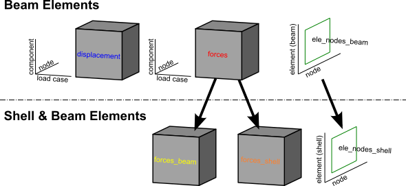
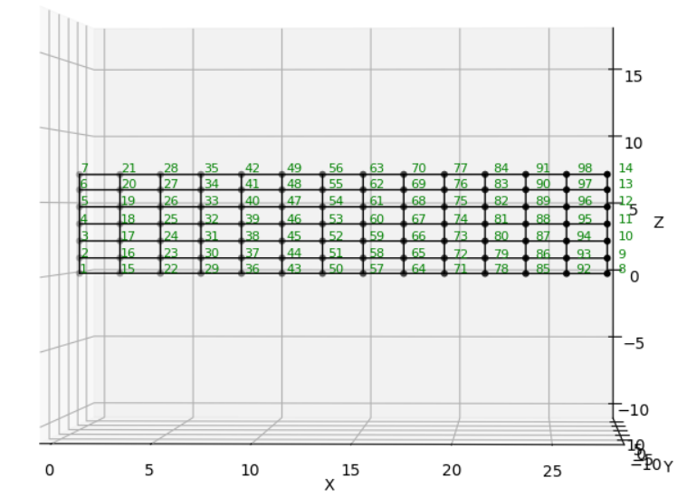
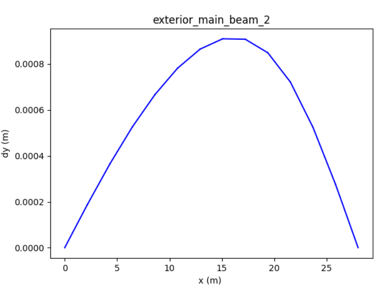
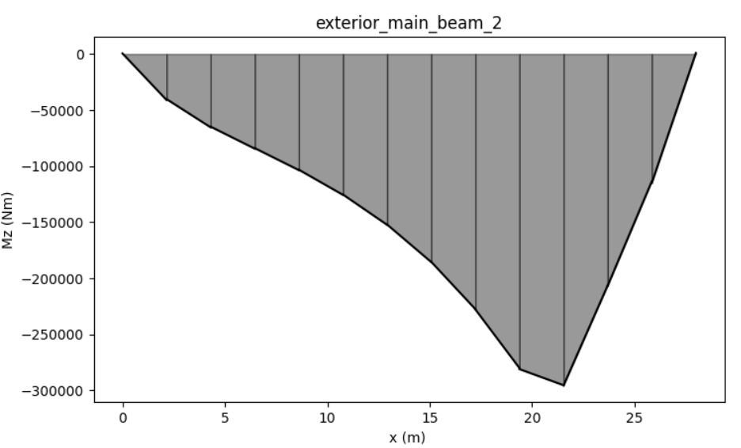

# Getting Results

For all example code in this page, *ospgrillage* is imported as `og`

```python
import ospgrillage as og
```

## Extracting results

After analysis, results are obtained using
{func}`~ospgrillage.osp_grillage.OspGrillage.get_results`.

```python
all_result   = example_bridge.get_results()
patch_result = example_bridge.get_results(load_case="patch load case")
```

The first call returns results for every load case; the second filters to one.

### What is an xarray Dataset?

The returned object is an [xarray Dataset](http://xarray.pydata.org/en/stable/generated/xarray.Dataset.html) — think of it as a multi-dimensional, labelled table. Rather than accessing data by integer index (row 3, column 7), you access it by *name* (`Loadcase="Barrier"`, `Component="Mz_i"`). This makes result queries self-describing and much less error-prone.

The Dataset contains three named **data variables**:

| Variable | Axes (dimensions) | Contents |
|---|---|---|
| `displacements` | Loadcase × Node × Component | Translations (dx, dy, dz) and rotations (theta\_x/y/z) at each node |
| `forces` | Loadcase × Element × Component | Internal forces (Mx, My, Mz, Vx, Vy, Vz) at each element end (\_i, \_j) |
| `ele_nodes` | Element × Nodes | Which node tags (i, j) belong to each element |

For a {ref}`shell-hybrid-model`, forces are split into `forces_beam` / `forces_shell`
and element connectivity into `ele_nodes_beam` / `ele_nodes_shell`.

Printing `all_result` shows the structure:

```
<xarray.Dataset>
Dimensions:        (Component: 18, Element: 142, Loadcase: 5, Node: 77, Nodes: 2)
Coordinates:
  * Component      (Component) <U7 'Mx_i' 'Mx_j' 'My_i' ... 'theta_y' 'theta_z'
  * Loadcase       (Loadcase) <U55 'Barrier' ... 'single_moving_point at glob...'
  * Node           (Node) int32 1 2 3 4 5 6 7 8 9 ... 69 70 71 72 73 74 75 76 77
  * Element        (Element) int32 1 2 3 4 5 6 7 ... 136 137 138 139 140 141 142
  * Nodes          (Nodes) <U1 'i' 'j'
Data variables:
    displacements  (Loadcase, Node, Component) float64 nan nan ... -4.996e-10
    forces         (Loadcase, Element, Component) float64 36.18 -156.9 ... nan
    ele_nodes      (Element, Nodes) int32 2 3 1 2 1 3 4 ... 32 75 33 76 34 77 35
```

Each line of `Coordinates` lists the labels along one dimension. `Loadcase` lists
every load case name; `Component` lists every result quantity; `Node` and `Element`
list the integer tags from the OpenSees model.

Figure 1 illustrates the overall dataset structure.



### Extracting the data variables

```python
disp_array = all_result.displacements  # nodal displacements & rotations
force_array = all_result.forces        # element end forces
ele_array   = all_result.ele_nodes     # element→node connectivity
```

### Available force and displacement components

To see the full list of component labels:

```python
force_array.coords['Component'].values
```

```
array(['Mx_i', 'Mx_j', 'My_i', 'My_j', 'Mz_i', 'Mz_j', 'Vx_i', 'Vx_j',
       'Vy_i', 'Vy_j', 'Vz_i', 'Vz_j', 'dx', 'dy', 'dz', 'theta_x',
       'theta_y', 'theta_z'], dtype='<U7')
```

Suffix `_i` / `_j` denotes the start / end node of the element respectively.

(access-results)=
### Selecting results by label

Use xarray's `.sel()` to pick results by *name*, and `.isel()` to pick by *integer position*:

```python
# All nodes, one component
disp_array.sel(Component='dy')

# One load case, one node
disp_array.sel(Loadcase="patch load case", Node=20)

# One load case, several elements
force_array.sel(Loadcase="Barrier", Element=[2, 3, 4])

# One component across all load cases
force_array.sel(Component='Mz_i')
```

For results from a {ref}`moving-load`, each increment is stored as a separate load case
named automatically as `"<load name> at global position [x,y,z]"`. You can select
these by full name or by position:

```python
# Select by the auto-generated name
by_name  = force_array.sel(Loadcase="patch load case at global position [0,0,0]")
# Select by integer index (0 = first increment)
by_index = force_array.isel(Loadcase=0)
```

```{note}
For information on the full range of indexing and selection operations available on
DataArrays, see the
[xarray indexing documentation](http://xarray.pydata.org/en/stable/user-guide/indexing.html).
```

## Getting combinations

Load combinations are computed on the fly in
{func}`~ospgrillage.osp_grillage.OspGrillage.get_results` by passing a `combinations`
dictionary: keys are load case name strings and values are load factors.
*ospgrillage* multiplies each load case by its factor and sums the results.

```python
comb_dict   = {"patch_load_case": 2, "moving_truck": 1.6}
comb_result = example_bridge.get_results(combinations=comb_dict)
print(comb_result)
```

```
<xarray.Dataset>
Dimensions:        (Component: 18, Element: 142, Loadcase: 3, Node: 77, Nodes: 2)
Coordinates:
  * Component      (Component) <U7 'Mx_i' 'Mx_j' 'My_i' ... 'theta_y' 'theta_z'
  * Node           (Node) int32 1 2 3 4 5 6 7 8 9 ... 69 70 71 72 73 74 75 76 77
  * Element        (Element) int32 1 2 3 4 5 6 7 ... 136 137 138 139 140 141 142
  * Nodes          (Nodes) <U1 'i' 'j'
  * Loadcase       (Loadcase) <U55 'moving_truck at global position [2...'
Data variables:
    displacements  (Loadcase, Node, Component) float64 nan nan ... 0.0 7.688e-05
    forces         (Loadcase, Element, Component) float64 36.18 -156.9 ... nan
    ele_nodes      (Loadcase, Element, Nodes) int32 6 9 3 6 ... 228 102 231 105
```

When a combination mixes static and moving load cases, the factored static load case
is added to *each* increment of the moving load.

## Getting load envelope

A load envelope finds the maximum (or minimum) of a chosen result component across
all load cases. Use {func}`~ospgrillage.postprocessing.create_envelope` to build an
{class}`~ospgrillage.postprocessing.Envelope` object, then call `.get()`:

```python
envelope = og.create_envelope(ds=comb_result, load_effect="dy", array="displacements")
disp_env = envelope.get()
print(disp_env)
```

By default `get()` returns, for each node, the *name of the load case* that produced
the maximum value of `dy`:

```
<xarray.DataArray 'Loadcase' (Node: 77, Component: 18)>
array([[nan, nan, nan, ...,
        'single_moving_point at global position [2.00,0.00,2.00]', ...],
       ...],
      dtype=object)
Coordinates:
  * Component  (Component) <U7 'Mx_i' 'Mx_j' 'My_i' ... 'theta_y' 'theta_z'
  * Node       (Node) int32 1 2 3 4 5 6 7 8 9 10 ... 69 70 71 72 73 74 75 76 77
```

For more options see {func}`~ospgrillage.postprocessing.create_envelope`.

## Getting specific properties of model

### Node

Use {func}`~ospgrillage.osp_grillage.OspGrillage.get_nodes` to retrieve node
information from the model.

### Element

Use {func}`~ospgrillage.osp_grillage.OspGrillage.get_element` to query element
properties and tags from the model.

## Plotting results

### Current limitation of OpenSees visualization modules

`OpenSeesPy`'s visualization modules (`vfo` and `opsvis`) require the model to be
active in the OpenSees model space. Results retrieved via `get_results()` are stored
in an xarray Dataset and cannot be fed back to these modules for multi-load-case
plotting. Additionally, neither module supports enveloping across multiple incremental
load cases.

For single-load-case inspection only, `opsvis` can be used directly after analysis:

```python
og.opsv.section_force_diagram_3d('Mz', {}, 1)
```

```{note}
`opsv` only works for model templates `beam_only` and `beam_link`. Shell model
plotting is not supported as of *ospgrillage* version 0.1.0.
```

### ospgrillage post-processing module

For multi-load-case or moving load results, *ospgrillage* includes a dedicated
post-processing module.

```{note}
The plotting functions of the post-processing module are at alpha development stage.
As of version 0.1.0 they are sufficient for plotting components from xarray DataSets.
```

For this section, we refer to an exemplar 28 m super-T bridge (Figure 2). The
grillage object is named `bridge_28`.



To plot deflection from the `displacements` DataArray use
{func}`~ospgrillage.postprocessing.plot_defo`, specifying a grillage member name:

```python
og.plot_defo(bridge_28, results, member="exterior_main_beam_2", option="nodes")
```



To plot internal forces from the `forces` DataArray use
{func}`~ospgrillage.postprocessing.plot_force`:

```python
og.plot_force(bridge_28, results, member="exterior_main_beam_2", component="Mz")
```


