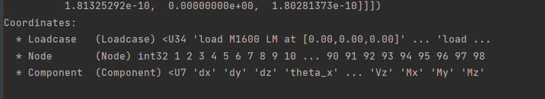

========================
Performing analysis
========================

Having created the grillage model, users can proceed with performing a grillage analysis. 
The *ops-grillage* module allows grillage analysis utilities
by allowing users to specify load cases comprising of multiple single or compound loads types
and then run load case analysis. 
Furthermore, *ops-grillage* module also options for moving load analysis.

Defining loads
------------------------

Available loads types include `Point`_, `Line`_, and `Patch`_ loads. 
Each of these load types are defined with a different class object of similar names. 
Two or more of these load types can be combined to form `Compound`_ loads.

Each load type requires
user to specify its load point(s).
This is achieved by a namedTuple :class:`LoadPoint(x,y,z,p)` where `x`,`y`,`z` are the coordinates of the load point
and `p` is the magnitude of the vertical loading.
The coordinates are generally in the global coordinate system with respect to the created grillage model.
However, a user-defined local coordinate system may also be used to assist in then creating `Compound`_ loads.
The vertical loading is in the direction of the global `y`-axis.
Loads in other directions and applied moments are currently not supported.

Depending on the load type, a minimum number of LoadPoint namedTuple objects
are required. These are defined used the `point#` variable for the load type class for the global coordinate system,
or else `localpoint#` variable for a user-defined local coordinate system, where # is a digit from 1 to 9.
Below are examples of creating different load types.

.. _Point:

Point Loads
^^^^^^^^^^^^^^^^^^^^^^^^^^^^^^^^^^^^^

Point loads are instantied with the :class:`PointLoad` class and takes only a single :class:`LoadPoint` tuple.
`p` in the :class:`LoadPoint`  tuple should have units of force (eg. N, kN, kips, etc).

The following example code is 20 force unit point load located at (5,0,2) in the global coordinate system. 

.. code-block:: python

    point_load_location = opsg.LoadPoint(5, 0, 2, 20)  # create load point
    Single = opsg.PointLoad(name="single point", point1=point_load_location)

To position the load instead in a user defined local coordinate system to later create a `Compound`_ loads, the variable `localpoint1` instead of `point1` is used. 

.. code-block:: python

    point_load_location = opsg.LoadPoint(5, 0, 2, 20)  # create load point
    Single = opsg.PointLoad(name="single point", localpoint1=point_load_location)

.. _Line:

Line Loads
^^^^^^^^^^^^^^^^^^^^^^^^^^^^^^^^^^^^^

Line loads are instantied with the :class:`LineLoading` and required at least two :class:`LoadPoint` tuple (corresponds to the start and end of the line load).
Using more than two tuples allows a curve line loading profile.
`p` in the :class:`LoadPoint` tuple should have units of force per distance (eg. kN/m, kips/ft, etc).

The following example code is a constant 2 force per distance unit line load (UDL)
in the global coordinate system from -1 to 11 distance units in the `x`-axis and along the position in the `z`-axis at 3 distance units.

.. code-block:: python

    barrier_point_1 = opsg.LoadPoint(-1, 0, 3, 2)
    barrier_point_2 = opsg.LoadPoint(11, 0, 3, 2)
    Barrier = opsg.LineLoading("Barrier curb load", point1=barrier_point_1, point2=barrier_point_2)

As before, to position the load instead in a user defined local coordinate system to later create a `Compound`_ loads, the variable `localpoint#` instead of `point#` is used. 

.. _Patch:

Patch loads
^^^^^^^^^^^^^^^^^^^^^^^^^^^^^^^^^^^^^

Patch loads are instantied with the :class:`PatchLoading` and required at least four :class:`LoadPoint` tuple (corresponds to the vertices of the patch load).
Using more than four tuples allows a curve surface loading profile.
`p` in the :class:`LoadPoint` tuple should have units of force per area.

The following example code is constant 5 force per area unit patch load 
in the global coordinate system. 
To position the load instead in a user defined local coordinate system, the variable `localpoint#` instead of `point#` is used. 

.. code-block:: python

    lane_point_1 = opsg.LoadPoint(0, 0, 3, 5)
    lane_point_2 = opsg.LoadPoint(8, 0, 3, 5)
    lane_point_3 = opsg.LoadPoint(8, 0, 5, 5)
    lane_point_4 = opsg.LoadPoint(0, 0, 5, 5)
    Lane = PatchLoading("Lane 1", point1=lane_point_1, point2=lane_point_2, point3=lane_point_3, point4=lane_point_4)

.. _Compound load:

Compound loads
^^^^^^^^^^^^^^^^^^^^^^^^^^^^^^^^^^^^^
Two or more groups of load objects can be compounded into a compound load. 

To create a compound load, use the :class:`CompoundLoad` class - passing load objects for compounding as input parameters.

The following code creates and add a point and line load to the :class:`CompoundLoad` object.

.. code-block:: python

    # compound load
    wheel_1 = opsg.PointLoad(opsg.LoadPoint(0, 0, 3, 5))
    wheel_2 = opsg.PointLoad(opsg.LoadPoint(0, 0, 3, 5))
    C_Load = opsg.CompoundLoad("Axle tandem")

After creating a compound load, users will have to add :class:`~Loads` objects (Point, Line, Patch) to the Compound load object:

.. code-block:: python

    C_Load.add_load(load_obj=wheel_1, local_coord=Point(5,0,5))
    C_Load.add_load(load_obj=wheel_2, local_coord=Point(3,0,5))

.. note::

    Compound loads require users to pay attention between basic and global coordinate system (see :ref:`ModuleDoc` for more information on coordinate systems)

    At the current stage, the :class:`~CompoundLoad` parses the load object within **local coordinate system**. When pass as input into :class:`~LoadCase`, the Compound load's vertices / load points
    are automatically converted to **global coordinates**, based on the inputs of ``set_global_coord`` function

**Coordinate System**

When adding each load object, the :class:`~CompoundLoad` class allow users to input a ``load_coord=`` keyworded parameter.
This relates to the load object - whether it was previously defined in the user-defined *local* or in the *global* coordinate system. The following explains the various
input conditions

* if Load object was defined in *local* coordinate and ``load_coord=`` is not provided. The local coordinate tied with the Load object precedes.
* if Load object was defined in *local* coordinate and ``load_coord=`` is provided. The local coordinate of ``load_coord=`` parameter precedes.
* if Load object was defined in *global* coordinate and ``load_coord=`` is not provided. Compound load treats the inherited global coordinates as new *local* coordinate
* if Load object was defined in *global* coordinate and ``load_coord=`` is provided. The local coordinate of ``load_coord=`` parameter precedes, the magnitude of load points/vertices carries over to local coordinate.

After defining all required load objects, :class:`~CompoundLoad` requires users to define the global coordinate which to map the user-defined local coordinates. 
If not specified, the mapping's reference point is default to the **Origin** of coordinate system i.e. (0,0,0)

For example, this code line shifts all load points of all load objects for **Single** and **Barrier** in the **C_Load** compound load by x + 4, y + 0 , and z + 3.

.. code-block:: python

    C_Load.set_global_coord(Point(4,0,3))

.. _load cases:

Load cases
______________________
Load cases are a set of load types (`Point`_, `Line`_, `Patch`_, `Compound load`_) used to define a particular loading condition. Compound loads are treated as a single load group within a load case
having same reference points (e.g. tandem axle) and properties (e.g. load factor)

After load type objects are created, users add the load objects to :class:`LoadCase` class objects. First, users instantiates a
:class:`LoadCase` class object and giving it its name.

.. code-block:: python

    DL = LoadCase(name="Dead Load")

Users then pass load objects as input parameters using ``add_load_groups()`` function.

.. code-block:: python

    DL.add_load_groups(Single)  # each line adds individual load types to the load case
    DL.add_load_groups(Barrier)
    DL.add_load_groups(Lane)

After adding loads, the :class:`LoadCase` object is added to grillage model for analysis using the ``add_load_case()``
function of :class:`OpsGrillage` class. Users repeat this step for any defined load cases.

.. code-block:: python

    example_bridge.add_load_case(DL)  # adding this load case to grillage model

Moving loads
------------------------
For moving load analysis, users create moving load objects using :class:`MovingLoad` class. The moving load class takes a load type object (`Point`_, `Line`_, `Patch`_, `Compound load`_) and moves the load
through a path points described by a :class:`Path` object and obtained by the ``get_path_points()`` method. 
Path are defined using two namedTuple :class:`Point(x,y,z)` to describe its start and end position.

The following example code is a line load is defined as a moving load travelling a path from 2 to 4 distance units in the global coordinate system.

.. code-block:: python

    line_point_1 = opsg.LoadPoint(0, 0, 3, 6)
    line_point_2 = opsg.LoadPoint(20, 0, 3, 6)
    Line = opsg.LineLoading("Line load", point1=line_point_1, point2=line_point_2)
	single_path = opsg.Path(start_point=opsg.Point(2,0,2), end_point= opsg.Point(4,0,2))  # create path object
    move_line = opsg.MovingLoad(name="Line Load moving")
    move_line.add_loads(load_obj=Line,path_obj=single_path.get_path_points())

After adding all load types and respective paths for a moving load, users run the class function ``parse_moving_load_case()`` which instructs the class to create multiple `load cases`_ for
which corresponds to the load condition as the load moves through each increment of the path.

.. code-block:: python

    move_point.parse_moving_load_cases() # step to finalise moving load - creates incremental load cases for each position of the moving load

From here, use the ``add_moving_load_case()`` function of the :class:`OpsGrillage` to add the moving load as a moving load case. 

.. code-block:: python

    example_bridge.add_moving_load_case(move_point)

Defining load combination
------------------------
Load combinations analysis are performed by using the :class:`OpsGrillage` function ``add_load_combination()`` function.
Load combinations are defined by passing an input dictionary of basic load case name as keys with load factors as
values. An example dictionary is shown as follows:

.. code-block:: python

    load_combinations = {'Dead Load':1.2,'Live traffic':1.7}
    example_bridge.add_load_combination(name = "ULS", input_dict = load_combinations )

Load combinations are automatically calculated at the end after analysing all load cases. The following section on Running Analysis will
explain how these load combinations are extracted.

Running analysis
------------------------

Once all loadcases (static or moving) have been defined and added to the grillage the analysis can be conducted.

To analyse non-moving loadcase(s), users run the class function ``analyse_load_case()``. 
This will analyse all non-moving load cases added to the grillage model previously.

.. code-block:: python

    example_bridge.analyse_load_case()

Users run ``analyse_moving_load_case()`` to analyze the moving load case.

.. code-block:: python

    example_bridge.analyse_moving_load_case()

Obtaining results
^^^^^^^^^^^^^^^^^^^^^^^^^^^^^^^^^^^^^
Results are returned as `data arrays <http://xarray.pydata.org/en/stable/user-guide/data-structures.html#>`_ (python's Xarray module).
To this, run the ``get_results()`` function and an output tuple of two objects will be returned:

.. code-block:: python

    basic_load_case_result,moving_load_results = example_bridge.get_results()

where,

* basic_load_case_result : a data array containing results for all non-moving load cases.
* moving_load_results: a list of data array each for a moving load (blank if ``analysis_moving_load_case()`` is not used).

Each data array contains dimensions of:

* load case : listing all load case
* Node : listing all nodes within mesh of grillage model
* Component: Node responses ordered in this manner - dx,dy,dz,theta_x,theta_y,theta_z,Vx,Vy,Vz,Mx,My,Mz

Here is an example of how the data array looks like in practice:

From here, users can use xarray's function for data array to extract 'slices' of data

For load combinations, users flag the `get_combination=` keyword as *True*.

.. code-block:: python

    load_combination_dict = example_bridge.get_results(get_combinations=True)

Instead of two data arrays, the function returns a single dict with names of load combinations as key, paired with a data array
of the load combination as its value. The data array has the same dimensions as those from basic_load_case_result and
moving_load_results, only this time the arrays are modified by load factors defined for the load combinations.
